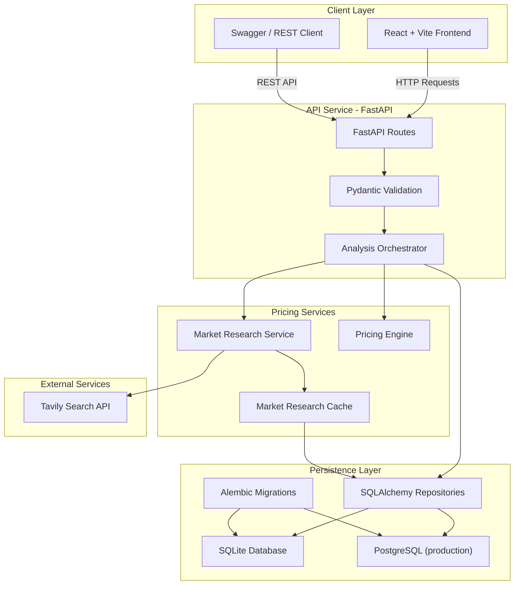

# PricePilot

A pricing intelligence platform built with React, FastAPI, Tavily Search, SQLAlchemy, Alembic, and SQLite. This project demonstrates full-stack application design for live market research, competitor price extraction, pricing recommendations, caching, persistence, and dashboard-ready pricing analytics.

## Architecture



## Features

* **Live market research** using Tavily Search
* **Multi-stage competitor retrieval** with fallback searches
* **Competitor price extraction and deduplication**
* **Outlier and plausibility filtering**
* **Demand and market-trend detection**
* **Baseline pricing** using cost and target margin
* **Market-led and baseline-led pricing recommendations**
* **Pricing strategy adjustments**
* **Confidence scoring and recommended price ranges**
* **Pricing reasoning trace**
* **Persistent market-research caching**
* **Dashboard** for recent pricing analyses
* **Analysis history** with persistent storage
* **REST API** with Swagger/OpenAPI documentation
* **Alembic database migrations**
* **Structured API error handling**
* **240 backend tests**

## Tech Stack

### Frontend

* **React**
* **Vite**
* **JavaScript**
* **React Router**
* **shadcn/ui**

### Backend

* **Python 3.11+**
* **FastAPI**
* **Pydantic**
* **SQLAlchemy 2.x**
* **Alembic**
* **httpx**

### Data & External Services

* **PostgreSQL** — production database
* **SQLite** — local development database
* **Tavily Search API**
* **SQLAlchemy** — database abstraction and ORM
* **Alembic** — database migrations

## Quick Start

### Prerequisites

* Node.js
* npm
* Python 3.11+
* Tavily API key

### Backend Setup

1. Clone the repository:

```bash
git clone https://github.com/sriya-vemuri/pricepilot.git
cd pricepilot
```

2. Create the backend environment file:

```text
backend/.env
```

Add:

```env
DATABASE_URL=sqlite:///./pricepilot.db
TAVILY_API_KEY=your_tavily_api_key
CORS_ORIGINS=http://localhost:5173,http://127.0.0.1:5173
```

Optional frontend root `.env`:

```env
VITE_API_BASE_URL=http://127.0.0.1:8000
```

3. Start the backend:

```bash
cd backend

python -m venv .venv
source .venv/bin/activate

pip install -e ".[dev]"
alembic upgrade head

uvicorn app.main:app --reload --host 127.0.0.1 --port 8000
```

4. Access backend services:

* API: `http://127.0.0.1:8000`
* Swagger UI: `http://127.0.0.1:8000/docs`
* Health Check: `http://127.0.0.1:8000/health`

## Deployment

PricePilot is deployed using:

* **Vercel** for the React frontend
* **Vercel** for the FastAPI backend
* **PostgreSQL / Neon** for production persistence
* **Tavily Search API** for market research

Production configuration uses environment variables for:

* `DATABASE_URL`
* `TAVILY_API_KEY`
* `CORS_ORIGINS`
* `VITE_API_BASE_URL`

### Frontend Setup

From the project root:

```bash
npm install
npm run dev
```

Access the frontend:

* Frontend: `http://localhost:5173`

## API Endpoints

### Create Pricing Analysis

```http
POST /api/analyses
```

Example:

```bash
curl -X POST http://127.0.0.1:8000/api/analyses \
  -H "Content-Type: application/json" \
  -d '{
    "product_name": "Apple AirPods Pro 2",
    "category": "electronics",
    "cost": 150,
    "target_margin": 30,
    "target_market": "United States",
    "strategy": "balanced"
  }'
```

### List Analyses

```http
GET /api/analyses?limit=50&offset=0
```

### Get Analysis

```http
GET /api/analyses/{analysis-id}
```


## Pricing Pipeline

PricePilot uses a deterministic pricing pipeline rather than directly asking an LLM to generate a price.

```text
Product Input
    ↓
Baseline Price
    ↓
Tavily Market Research
    ↓
Price Extraction
    ↓
Deduplication & Filtering
    ↓
Demand / Trend Detection
    ↓
Pricing Engine
    ↓
Confidence & Sanity Checks
    ↓
Database Persistence
    ↓
Pricing Recommendation
```

The pricing engine evaluates:

* product cost
* target margin
* competitor pricing
* pricing strategy
* demand level
* market trend
* market-data reliability

Depending on the available evidence, PricePilot can generate:

* **Baseline-led recommendations**
* **Market-led recommendations**
* **Feasibility override recommendations**

## Market Research Cache

PricePilot uses persistent caching to reduce unnecessary Tavily requests for repeated market research.

The cache key is based on:

* product name
* category
* target market
* pricing mode

The cache stores candidate prices **before baseline-aware filtering**.

When cached research is reused, PricePilot re-filters the candidate prices using the current analysis baseline.

```text
Cached Candidate Prices
        ↓
Current Analysis Baseline
        ↓
Price Filtering
        ↓
Current Comparable Prices
```

This allows the same market research to be safely reused across analyses with different costs and target margins.

Temporary Tavily outages are not cached.

## Database

PricePilot currently uses three main tables:

### analyses

Stores the pricing analysis and product snapshot, including:

* product name
* category
* cost
* target margin
* pricing strategy
* baseline price
* recommended price
* confidence
* pricing rationale
* reasoning trace

### market_data

Stores market research associated with each analysis, including:

* competitor prices
* comparable prices
* market trend
* demand level
* data reliability
* retrieval mode
* market warnings

### market_cache

Stores reusable Tavily research data to reduce repeated external API calls.

SQLite is used for local development while SQLAlchemy keeps the persistence layer portable for a future PostgreSQL deployment.

## Design Decisions

### Single Analysis Endpoint

The frontend creates an analysis through one endpoint:

```text
POST /api/analyses
```

The backend internally coordinates:

```text
Market Research
→ Pricing Engine
→ Persistence
→ Response
```

This keeps orchestration out of the frontend and provides a simpler API contract.

### Analysis Orchestrator

`AnalysisOrchestrator` coordinates the complete pricing-analysis workflow.

It connects:

* market research
* pricing calculations
* database persistence

This keeps FastAPI routes thin and separates HTTP concerns from business logic.

### Deterministic Pricing Engine

Pricing recommendations are generated using backend pricing logic rather than directly asking an LLM to generate a price.

The engine considers:

* product cost
* target margin
* competitor pricing
* pricing strategy
* demand level
* market trend
* market-data reliability

### Multi-Stage Market Research

Market research uses multiple Tavily search stages.

If the first search does not produce enough usable competitor prices, PricePilot performs additional product-specific searches before using baseline-led pricing.

### Persistent Market Cache

Tavily research is cached to reduce duplicate external API calls.

Candidate prices are cached before baseline-aware filtering so research can be safely reused for analyses with different cost and margin assumptions.

### Layered Backend Architecture

The backend separates:

* API routes
* orchestration
* market research
* pricing logic
* repositories
* database access

This makes each layer easier to test and maintain independently.

### SQLite with PostgreSQL-Ready Models

SQLite keeps local development simple.

SQLAlchemy models use portable types and string enums so the application can later migrate to PostgreSQL without redesigning the business layer.

### Alembic Migrations

Database schema changes are managed through Alembic rather than automatically creating tables at application startup.

Run migrations with:

```bash
alembic upgrade head
```

## Project Structure

```text
pricepilot/
├── src/
│   ├── api/
│   │   ├── analyses.js
│   │   ├── client.js
│   │   └── errors.js
│   │
│   ├── components/
│   │   ├── analysis/
│   │   ├── dashboard/
│   │   ├── layout/
│   │   ├── results/
│   │   └── ui/
│   │
│   ├── pages/
│   │   ├── Dashboard.jsx
│   │   ├── History.jsx
│   │   ├── NewAnalysis.jsx
│   │   └── Results.jsx
│   │
│   └── App.jsx
│
├── backend/
│   ├── alembic/
│   │   └── versions/
│   │
│   ├── app/
│   │   ├── api/
│   │   ├── clients/
│   │   ├── db/
│   │   ├── models/
│   │   ├── repositories/
│   │   └── services/
│   │       ├── market_research/
│   │       ├── pricing/
│   │       └── analysis_orchestrator.py
│   │
│   └── tests/
│       ├── integration/
│       └── unit/
├── .env.example
├── package.json
└── README.md
```

## Build

Build the frontend:

```bash
npm run build
```

Run frontend validation:

```bash
npm run lint
npm run typecheck
```

## Testing

### Backend

Run all backend tests:

```bash
cd backend
pytest
```

The backend currently includes **240 passing tests** covering:

* pricing calculations
* baseline calculations
* competitor statistics
* market research
* price extraction and filtering
* trend and demand detection
* Tavily retries and failures
* persistent caching
* SQLAlchemy repositories
* Alembic migrations
* analysis orchestration
* FastAPI endpoints

### Frontend

Run:

```bash
npm run build
npm run lint
npm run typecheck
```

## API Documentation

When the backend is running, interactive API documentation is available at:

* Swagger UI: `http://127.0.0.1:8000/docs`
* OpenAPI JSON: `http://127.0.0.1:8000/openapi.json`

## Current Status

The core PricePilot workflow is operational:

* **React frontend**
* **FastAPI backend**
* **Tavily market research**
* **Multi-stage price retrieval**
* **Pricing engine**
* **Persistent market cache**
* **SQLite local persistence** (PostgreSQL-ready for production)
* **Dashboard**
* **Analysis history**
* **Results page**

## Deployment

PricePilot is deployed using:

* **Vercel** for the React frontend
* **Vercel** for the FastAPI backend
* **PostgreSQL / Neon** for production persistence
* **Tavily Search API** for market research

Production configuration uses environment variables for:

* `DATABASE_URL`
* `TAVILY_API_KEY`
* `CORS_ORIGINS`
* `VITE_API_BASE_URL`